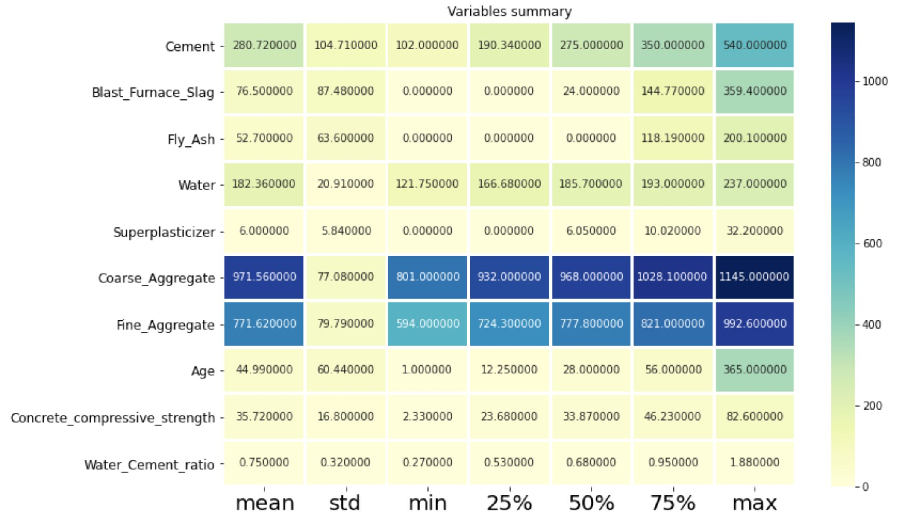

# <h1 align="center"> Compressive Strength of Concrete Analysis</h1> 

Prepared by- [Shantanil Bagchi](https://www.linkedin.com/in/shantanilbagchi/)

## Objective
The concrete compressive strength is a highly nonlinear function of age and ingredients. These ingredients include cement, blast furnace slag, fly ash, water, superplasticizer, coarse aggregate, and fine aggregate. Your objective is to build a machine learning model that would help Civil Engineers to estimate the compressive strength of the concrete and they can further take a decision whether the concrete should be used in their current project or not.

## Dataset Summary

| Component           | Variable Type 
| -------------       |:-------------:|
| Cement              | Input Variable |
| Blast Furnace Slag  | Input Variable|
| Fly Ash             | Input Variable|
| Water               | Input Variable|
| Superplasticizer    | Input Variable|
| Coarse Aggregate    | Input Variable|
| Fine Aggregate      | Input Variable|
| Age                 | Input Variable|
| **Concrete compressive strength** | **Output Variable** |

## Data Head

## Data Summary

## Histogram + Skewness Degree

### **Key Insights**
- Cement is almost normal.
- Blast Furnace Slag has two/three gausssians and rightly skewed.
- Fly Ash has two gaussians and rightly skewed.
- Water has three guassians and slighly left skewed.
- Superplasticizer has two gaussians and rightly skewed.
- Coarse Aggregate has three guassians and almost normal.
- Fine Aggregate has almost two guassians and looks like normal.
- Age has multiple guassians and rightly skewed.

## Relationship between dependent and independent attributes

### **Concrete Compressive Strength comparision independent attributes**

- **Strength vs Cement**: It is linearly related to the cement. Although the relationship is positive, for a given value of cement we have a multiple values of strength. Hence, it is not a very good predictor.
- **Strength vs Slag and Fly Ash**: There is no particular trend as a lot of values are zero.
- **Strength vs Age**: For a given value of age, we have different values of strength. Hence, it is not a very good predictor.
- **Strength vs Superplasticizer**:For a given value of age, we have different values of strength with a lot of vaues being zero. Hence, it is not a good predictor.
- Other attributes do not give any strong relationship with Strength. 

Hence, we can see that none of the independent attributes are a good predictors of the strength attribute. So, we will not use Linear model. 

**Thus, an interaction term has been created i.e. water/cement ratio which has inverse relation with Strength. Moreover, Water and Cement Columns are dropped as their relationship has already been captured in the interaction term**

## HeatMap

## Models

| Model                       | RMSE    | Accuracy     |
| --------------------------- |:-------:| :----------: |
| Gradient Boosting Regressor | 5       | 91.32        |
| Random Forest Regressor     | 4.87    | 91.78        |
| Decision Tree Regressor     | 6.51    | 85.32        |
| Extra Trees Regressor       | 4.52    | 92.91        |
| AdaBoost Regressor          | 7.64    | 79.77        |
| **XGBoost Regressor**       | 4.29    | 93.62        |
| Deep Neural Network         | 4.03    | 93           |
| **Bagging Regressor (estimator= grid_searched XGBoost)**       | 3.64    | 95.6        |

### XGBoost Regressor Baseline

### Results After Hyperparameter Tuning

### Neural Network Performance
After 500 epochs batch size 32

## Conclusion
Bagging Regressor with base estimator as XGBoostRegressor with hyparameters tuned with GridSearch results in the best performance with accuracy of over 95%. 

***Note-***
* Outlier detection had been done but resulted in comparatively poor performance.
* New feature engineering i.e water/binder ratio introduced but didn't result in improved performance.
* Columns (Fly Ash, Coarse Agg, Fine Agg) were removed to check performance but didn't do well.

Follwing is the result for reference wrt **XGBoost** (not included in the notebook)
| Detail                                            | RMSE(Whole) | Test Acc |
| :-------------                                    | :----------:|:--------:|
|  X_original                                             | 5.04  |  90.78 |
|  X_without_outliers                                     | 5.06  | 90.37  |
|  X_with_columns_removed (Fly Ash, Coarse Agg, Fine Agg) | 5.08  |  90.61 |
|  X_feature_engineered_with_water_cement                 | 4.78  | 91.69  |
|  X_feature_engineered (without Water, Cement)           | 4.29  |  93.62 |

